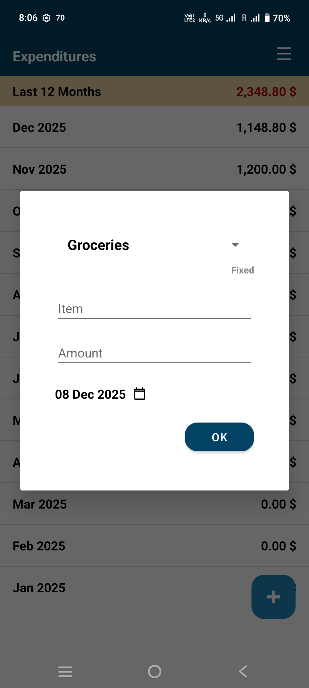
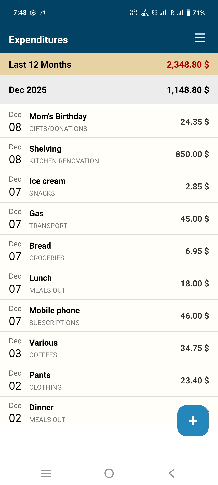
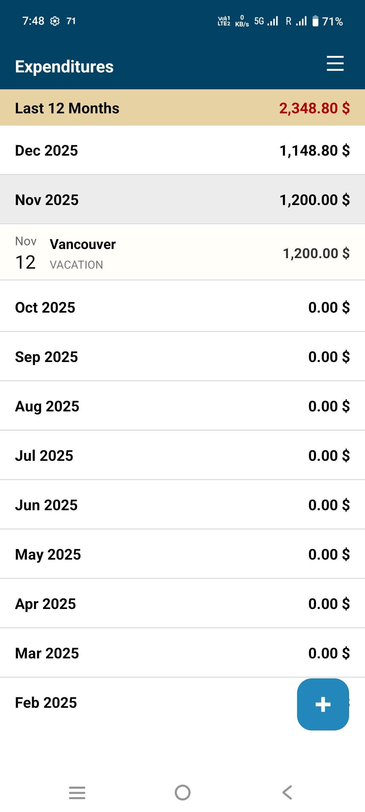
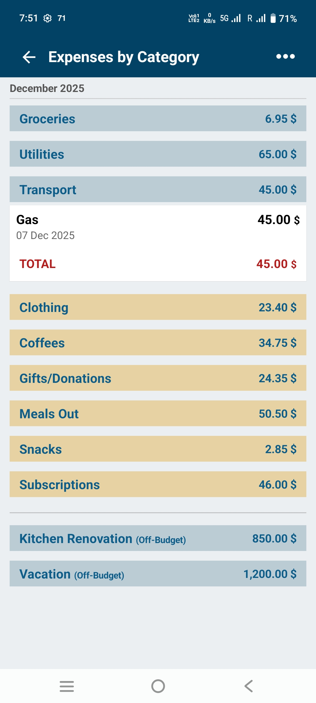
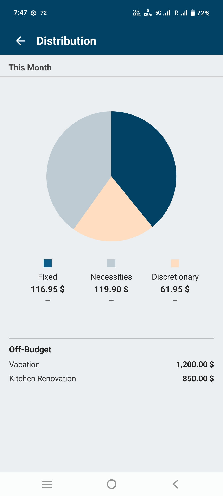
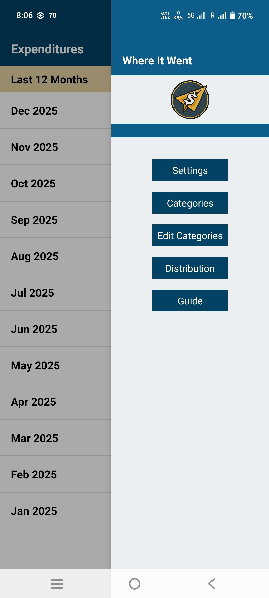

Great — here is your **final, production-ready README.md for v2.0**, formatted cleanly, with all screenshot references inserted exactly as they should appear.

**Yes — I can insert the screenshot image references**, *but you must manually place the actual PNG files in*:

```
docs/screenshots/
```

Your README will reference:

```
docs/screenshots/01_add.png
docs/screenshots/02_month.png
docs/screenshots/03_month_2.png
docs/screenshots/04_categories.png
docs/screenshots/05_distribution.png
docs/screenshots/06_drawer.png
```

As long as the files exist in that directory, GitHub will display them perfectly.

---

# ✅ **FINAL README.md (v2.0)**

**Copy/paste directly into your README.md**

---

# 📱 Where It Went

*A simple, offline-first budgeting app designed for real life.*

---

# **Where It Went**

**Track your spending — not your soul.**
*A no-fluff, privacy-respecting expense tracker built for everyday use.*

---

## 🧭 What Is This?

**Where It Went** is a simple, intentional daily expense tracker built for people who just want to know:

> *“Where did all my money go?”*

No accounts.
No syncing.
No ads.
No tracking.

Just fast, clean expense logging with clear overviews.

---

## 🌱 Why It Exists

Most expense trackers are:

* Bloated with dashboards and subscriptions
* Full of tracking SDKs
* Designed to harvest personal data
* Or require bank access just to log a sandwich

**Where It Went** is the opposite — intentionally simple, private, and focused.

It does one thing well:
**help you understand where your money actually went.**

---

## ✨ Key Features (v2.0)

* 🚀 **New Add-Expense Dialog** via floating action button
* 🗂️ **Clean navigation** across Month, Date, Category, Day Detail
* 📊 **Distribution Graph**: Fixed · Necessities · Discretionary · Off-Budget
* 👜 **Off-Budget Summary** (great for trips, projects, special events)
* 📤 **Export** to HTML and CSV
* 🔒 **Fully offline** (no network permission at all)
* 🙅 **No ads, no analytics, no nonsense**

---

## 🛠️ Who It’s For

* People who want a simple spending log
* Makers tracking project expenses
* Travelers tracking trip costs
* Privacy-conscious users
* Anyone tired of “budgeting tools” that feel like tax software

---

## 📦 Installation

* Download the **signed v2.0 APK** from:
  👉 [https://github.com/PIXEL-PEN/Where-It-Went/releases](https://github.com/PIXEL-PEN/Where-It-Went/releases)

* **F-Droid version** will be available after the metadata merge request is approved.

---

## 📌 Philosophy

> *“A system is only as good as the data you feed it.”*

**Where It Went** stays out of your way — so you can log expenses consistently and actually benefit from clear, accurate insights.

Perfect for:

* Daily spending habits
* Multi-day trips
* Home improvement or maker projects
* Tracking categories without spreadsheets

---

## 🧱 Open Source

* MIT-licensed
* Zero telemetry
* No remote connections
* Transparent, minimal codebase

---

## 📬 Feedback & Contributions

Ideas, issues, or suggestions?
Open an issue or start a discussion on GitHub.

---

## 📱 Screenshots (v2.0)

### Main Actions

| Add Expense (Dialog)                                 | Month View                                             |
| ---------------------------------------------------- | ------------------------------------------------------ |
|  |  |

### Month & Category Views

| Expanded Month                                           | Categories                                                  |
| -------------------------------------------------------- | ----------------------------------------------------------- |
|  |  |

### Distribution & Navigation

| Distribution Graph                                            | Navigation Drawer                                       |
| ------------------------------------------------------------- | ------------------------------------------------------- |
|  |  |

---

## 📄 License

MIT License. See [LICENSE](LICENSE).

---

# 🎉 Done

If you'd like, I can also generate:

* **v2.0 GitHub Release text**
* **Updated CHANGELOG entry**
* **F-Droid merge request instructions**

Just say the word.
